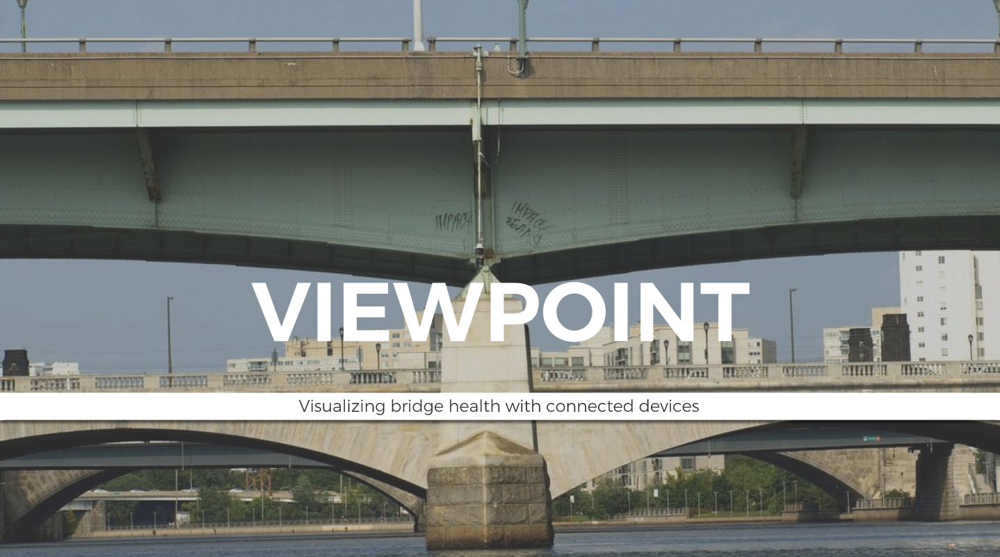
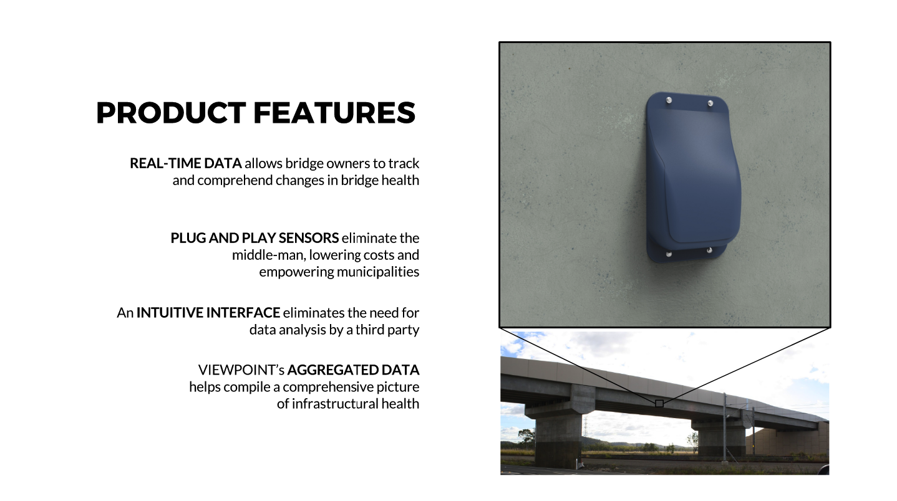
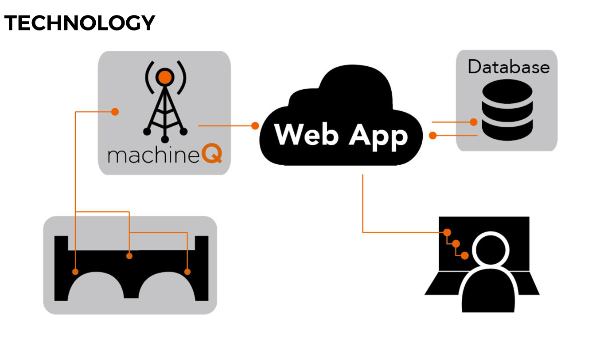

# Viewpoint Bridge Sensor

  
Viewpoint simplifies structural health monitoring and helping bridge owners detect issues earlier and with more reliability.  

**Team**: Jono Sanders, Evan OJ, Kevin Martin

**Demo**: (http://viewpointbridge.github.io/Viewpoint/)

### DESCRIPTION

The product provides low cost low fidelity, high spatial resolution vulnerability assessment on a network that builds upon other data sources.
REAL-TIME DATA allows bridge owners to track and comprehend changes in bridge health.    
PLUG AND PLAY SENSORS eliminate the middle-man, lowering costs and empowering municipalities.    
An INTUITIVE INTERFACE eliminates the need for data analysis by a third party.    
VIEWPOINT’s AGGREGATED DATA helps compile a comprehensive picture of infrastructural health

### IMAGES

